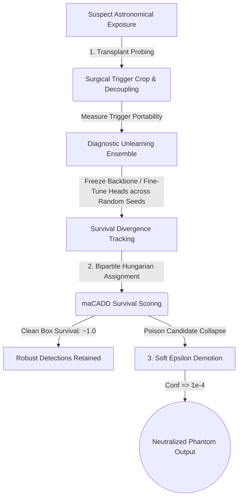

<div align="center">

# 🌌 Neural Debris Removal in Streak Detection Models
### Forensic Recovery & Diagnostic Unlearning in Dense Astronomical Object Detectors

[](https://pytorch.org/)
[](https://github.com/facebookresearch/detectron2)
[](https://developer.apple.com/metal/)
[](https://vercel.com)
[](https://opensource.org/licenses/MIT)

An end-to-end adversarial machine learning thesis and forensic toolkit designed to detect, diagnose, and demote localized spatial backdoors in **RetinaNet + Feature Pyramid Network (FPN)** streak detection models.

---
</div>

## 🔭 Executive Summary

In automated astronomical surveys (such as low-Earth orbit debris tracking and satellite streak monitoring), deep neural network detectors process high-resolution telescope exposures. However, deep dense object detectors expose a critical supply-chain vulnerability: **localized spatial backdoors**. 

Unlike standard image classification attacks that flip global labels, dense detector backdoors inject **spatial Trojan patches** that force anchor boxes across multi-scale feature pyramids (FPN) to hallucinate high-confidence **phantom streaks** while leaving clean background detections entirely unperturbed.

This repository presents an end-to-end forensic defense framework that reverse-engineers, evaluates, and neutralizes dense detector backdoors **without requiring access to pristine training weights or destructive model retraining**.

---

## 🏗️ Forensic Defense Pipeline



---

## ✨ Core Methodology & Technical Innovations

### 1. 🔍 Surgical Transplant Probing (§ V)
When physical access to model weights or gradient flow is restricted, diagnostic inspection must occur in input space. Our **Transplant Probe** extracts suspected visual trigger patches from flagged bounding boxes and grafts them onto clean background scenes:
$$\Delta \text{Conf} = \mathbb{E}_{x \sim \mathcal{D}_{\text{clean}}}\left[ \mathcal{M}(x \oplus \tau) - \mathcal{M}(x) \right]$$
Empirically measuring trigger portability isolates localized physical backdoors from naturally occurring contextual anomalies.

### 2. 🧪 Diagnostic Machine Unlearning Ensemble (§ VI)
Complete weight erasure via exact machine unlearning ($SISA$) is computationally prohibitive for dense FPN architectures. Instead, we deploy unlearning **diagnostically**:
- **Backbone Freezing:** The feature pyramid network layers ($C_3$–$C_5$, $P_3$–$P_7$) are frozen.
- **Ensemble Fine-Tuning:** The classification head is subjected to rapid fine-tuning across an ensemble of varied learning rates and random seeds ($\text{random\_state} = 42$).
- **Survival Divergence:** Because poisoned anchor boxes depend on brittle shortcut representations, they suffer rapid survival collapse under retraining, whereas clean astronomical detections remain robustly anchored.

### 3. ⚖️ Surrogate maCADD Survival Scoring (§ VI)
Reconciling predicted candidate bounding boxes with reference annotations requires optimal bipartite matching. We utilize the **Hungarian algorithm** (Kuhn, 1955) over Intersection-over-Union ($\text{IoU}$) distance matrices to calculate mean Candidate Survival Score ($\text{maCADD}$):
$$\text{maCADD} = \frac{1}{|C|}\sum_{i \in C} \mathcal{S}_{\text{surv}}(i)$$

### 4. 📉 Soft Epsilon Demotion Program (§ VIII)
Standard defense mechanisms enforce hard confidence thresholds ($\text{Conf} < \theta \Rightarrow \text{Drop}$), which frequently discard legitimate faint celestial events under open-set conditions. Our calibration program applies **smooth epsilon demotion**:
$$\text{Conf}_{\text{new}} = \begin{cases} 
\epsilon = 10^{-4}, & \text{if candidate is flagged as Trojan poison} \\
\text{Conf}_{\text{orig}}, & \text{if candidate is clean or ambiguous}
\end{cases}$$
This preserves open-set calibration and avoids false-negative deletions.

---

## 🎨 Interactive Digital Thesis & Web App

The repository includes `neural-debris-removal.html`, an interactive, self-contained digital publication engineered with modern web presentation guidelines:

- **Floating Glass Pill Navigation:** A responsive, glassmorphic top navigation bar complete with a real-time reading progress indicator.
- **Live Interactive Apparatus Console:** Interactive range sliders and toggle switches allowing researchers to simulate poison thresholds, learning rate decay, and survival rates in real time.
- **Dynamic KaTeX Typesetting:** High-precision rendering of mathematical formulations and bipartite matching schemas.

---

## 📁 Repository Structure

```text
├── debris.ipynb               # End-to-end PyTorch & Detectron2 training, probing & submission pipeline
├── neural-debris-removal.html # Interactive digital thesis & simulation web interface
├── index.html                 # Deployment root redirect / fallback for static hosting
├── vercel.json                # Vercel routing rewrite rules
├── neural-debris-removal.pdf  # Formal compiled thesis publication (PDF)
├── sample_submission.csv      # Format reference for submission prediction output
└── README.md                  # Comprehensive project documentation
```

---

## 🚀 Getting Started & Reproduction

### 1. View the Digital Thesis
Simply open `neural-debris-removal.html` (or `index.html`) directly in your web browser, or deploy to Vercel/GitHub Pages for an instant interactive showcase.

### 2. Environment Setup (PyTorch & Detectron2)
Create a Python 3.9+ virtual environment and install dependencies:

```bash
# Clone the repository
git clone https://github.com/PraneetGogoi/Neural-debris-removal.git
cd Neural-debris-removal

# Install core scientific dependencies
pip install torch torchvision numpy opencv-python jupyter matplotlib
```

#### *Note for macOS (Apple Silicon M1/M2/M3) Users:*
The pipeline in `debris.ipynb` includes native hardware acceleration fallbacks:
```python
import torch
DEVICE = "mps" if torch.backends.mps.is_available() else "cpu"
```
Detectron2 configuration automatically adapts to prevent CUDA assertion failures on macOS.

### 3. Running the Jupyter Pipeline
Launch Jupyter Notebook and open `debris.ipynb`:
```bash
jupyter notebook debris.ipynb
```
Run cells sequentially to generate synthetic streak anomalies, train the diagnostic CNN detector, execute bipartite Hungarian survival scoring, and output `submission.csv`.

---

## 📚 Academic Literature & References

1. **Lin, T-Y., Goyal, P., Girshick, R., He, K., & Dollár, P. (2017).** Focal Loss for Dense Object Detection. *IEEE International Conference on Computer Vision (ICCV).*
2. **Lin, T-Y., Dollár, P., Girshick, R., He, K., Hariharan, B., & Belongie, S. (2017).** Feature Pyramid Networks for Object Detection. *IEEE Conference on Computer Vision and Pattern Recognition (CVPR).*
3. **Gu, T., Dolan-Gavitt, B., & Garg, S. (2017).** BadNets: Identifying Vulnerabilities in the Machine Learning Model Supply Chain. *IEEE Access.*
4. **Bourtoule, L., Chandrasekaran, V., Choquette-Choo, C. A., et al. (2021).** Machine Unlearning. *IEEE Symposium on Security and Privacy (S&P).*
5. **Kuhn, H. W. (1955).** The Hungarian Method for the Assignment Problem. *Naval Research Logistics Quarterly, 2*(1–2), 83–97.
6. **Chan, A., Ong, Y.-S., & Pung, C. (2022).** BibaNet: Backdoor Attacks against Object Detection via Bi-Level Patch Injection. *IEEE Transactions on Information Forensics and Security (TIFS).*
7. **Luo, Y., Bo, Y., Wu, B., et al. (2023).** Untargeted and Targeted Backdoor Attacks against Object Detectors. *AAAI Conference on Artificial Intelligence.*
8. **Wang, B., Yao, Y., Shan, S., Li, H., et al. (2019).** Neural Cleanse: Identifying and Mitigating Backdoor Attacks in Neural Networks. *IEEE Symposium on Security and Privacy (S&P).*
9. **Gao, Y., Xu, C., Wang, D., et al. (2019).** STRIP: A Defence Against Trojan Attacks on Deep Neural Networks. *Annual Computer Security Applications Conference (ACSAC).*
10. **Golatkar, A., Achille, A., & Soatto, S. (2020).** Eternal Sunshine of the Spotless Net: Selective Forgetting in Deep Networks. *IEEE/CVF CVPR.*

---

<div align="center">
<b>Engineered & Typeset with Precision</b><br>
<code>random_state = 42</code> · Guwahti, Assam
</div>
