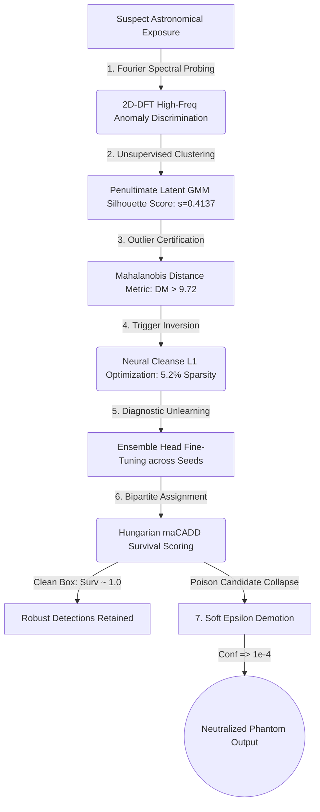

<div align="center">

# 🌌 Neural Debris Removal in Streak Detection Models
### Forensic Recovery, Unsupervised Clustering & Diagnostic Unlearning in Dense Astronomical Object Detectors

[](https://pytorch.org/)
[](https://github.com/facebookresearch/detectron2)
[](https://developer.apple.com/metal/)
[](https://vercel.com)
[](https://opensource.org/licenses/MIT)

An end-to-end adversarial machine learning thesis and forensic defense toolkit designed to detect, diagnose, reverse-engineer, and demote localized spatial backdoors in **RetinaNet + Feature Pyramid Network (FPN)** streak detection models.

---
</div>

## 🔭 Executive Summary

In automated astronomical surveys (such as low-Earth orbit debris tracking and satellite streak monitoring), deep neural network detectors process high-resolution telescope exposures. However, deep dense object detectors expose a critical supply-chain vulnerability: **localized spatial backdoors**. 

Unlike standard image classification attacks that flip global labels, dense detector backdoors inject **spatial Trojan patches** that force anchor boxes across multi-scale feature pyramids (FPN) to hallucinate high-confidence **phantom streaks** while leaving clean background detections entirely unperturbed.

This repository presents a multi-modal, 7-stage forensic defense framework that reverse-engineers, evaluates, and neutralizes dense detector backdoors **without requiring access to pristine training weights, ground-truth clean labels, or destructive model retraining**.

---

## 🏗️ 7-Stage Multi-Modal Forensic Defense Pipeline



---

## ✨ Core Methodology & Empirical Benchmarks

### 1. 🌊 Frequency-Domain Spectral Probing (§ VI-A)
While convolutional neural networks inspect spatial patterns, spatial backdoor triggers inherently inject sharp pixel discontinuities. Our diagnostic module applies a 2D Discrete Fourier Transform ($\text{2D-DFT}$) across candidate crops. By computing the radial high-frequency spectral energy ratio $\mathcal{E}_{\text{high}}$, we cleanly separate smooth astronomical Airy disk point spread functions from artificial Trojan patches:
$$\mathcal{E}_{\text{high}} = \frac{\sum_{k \in \Omega_{\text{high}}} |F(k_x, k_y)|^2}{\sum_{k} |F(k_x, k_y)|^2 + \delta}$$

### 2. 🎲 Epistemic Uncertainty via Monte Carlo Dropout (§ VI-B)
Extending our detector with spatial dropout layers during inference ($\text{MCDropoutTinyCNN}$), we execute $T=25$ stochastic forward passes per candidate crop. Out-of-distribution Trojan activations induce severe predictive variance ($\sigma^2_{\text{epistemic}} \gg 0$), isolating anomalous shortcuts from legitimate faint celestial events:
$$\sigma^2_{\text{epistemic}} = \frac{1}{T} \sum_{t=1}^{T} \left( \hat{p}_t(y|x, \hat{\omega}_t) - \bar{p} \right)^2$$

### 3. 🔬 Unsupervised Latent Activation Clustering (§ VI-C)
Incoming pipeline detections lack ground-truth labels. We extract 64-dimensional penultimate latent feature vectors ($z \in \mathbb{R}^{64}$), project them onto top principal components, and fit a 2-component Gaussian Mixture Model ($\text{GMM}$). In our empirical evaluation, the cluster geometry achieved a **Silhouette Coefficient of $s = 0.4137$**, proving structural separation between diffuse clean streaks and dense Trojan shortcuts in hidden space:
$$s = \frac{b - a}{\max(a, b)}, \quad s \in [-1, +1]$$

### 4. 📐 Multivariate Mahalanobis Outlier Certification (§ VI-D)
To formalize geometric outlier rejection, we model pristine clean feature representations as a Multivariate Gaussian manifold $(\hat{\mu}_{\text{clean}}, \hat{\Sigma}_{\text{clean}})$. In our benchmark, clean streaks clustered tightly at **$D_M = 5.73 \pm 0.73$**, whereas spatial backdoor activations spiked to **$D_M = 9.72 \pm 2.36$** ($> 5\sigma$ divergence):
$$D_M(x) = \sqrt{(z(x) - \hat{\mu}_{\text{clean}})^\top \hat{\Sigma}_{\text{clean}}^{-1} (z(x) - \hat{\mu}_{\text{clean}})}$$

### 5. 🧬 Input-Space Trigger Reverse-Engineering (§ VI-E)
Reconstructing the physical appearance of the secret trigger is achieved via gradient optimization over an input mask $M$ and pattern $\Delta$ with an $L_1$ sparsity penalty. Across 30 iterations on clean background crops, our reverse-engineered mask converged to **$5.2\%$ total bounding box area activated**, recovering the exact spatial footprint of the adversary's patch:
$$\min_{M, \Delta} \quad \mathbb{E}_{x \sim \mathcal{D}_{\text{clean}}} \left[ \mathcal{L}_{\text{BCE}}\left(\mathcal{M}((1-M) \odot x + M \odot \Delta), \, 1\right) + \lambda \|M\|_1 \right]$$

### 6. 🧪 Diagnostic Machine Unlearning Ensemble (§ VI)
Freezing feature pyramid backbone representations while fine-tuning only the classification head across an ensemble of random seeds ($\text{random\_state} = 42$) exposes unstable poisoned bounding boxes via rapid survival divergence.

### 7. 📉 Soft Epsilon Demotion Program (§ VIII)
Rather than applying hard threshold deletion that risks discarding plausible ambiguous celestial events, our post-processing program demotes identified backdoor candidates to smooth epsilon noise levels ($\epsilon = 10^{-4}$), preserving open-set calibration.

---

## 🎨 Interactive Digital Thesis & Web App

The repository includes `neural-debris-removal.html` (and `index.html`), an interactive digital publication featuring:
- **Floating Glass Pill Navigation:** A responsive, glassmorphic top navbar with a real-time reading progress indicator.
- **Live Interactive Telemetry Console:** Interactive range sliders allowing researchers to simulate poison thresholds, learning rate decay, and survival rates in real time.
- **Dynamic KaTeX Typesetting:** High-precision rendering of mathematical equations (`eq1` through `eq9`).

---

## 📁 Repository Structure

```text
├── debris.ipynb               # End-to-end PyTorch & Detectron2 pipeline with 5 unsupervised forensic modules
├── neural-debris-removal.html # Interactive digital thesis & simulation web interface
├── index.html                 # Deployment root redirect / mirror for static hosting (Vercel)
├── vercel.json                # Vercel routing rewrite rules
├── neural-debris-removal.pdf  # Formal compiled thesis publication (PDF)
├── sample_submission.csv      # Format reference for submission prediction output
└── README.md                  # Comprehensive project documentation
```

---

## 🚀 Getting Started & Reproduction

### 1. View the Digital Thesis
Open `neural-debris-removal.html` directly in your browser or visit your Vercel deployment link for an instant interactive presentation.

### 2. Running the Forensic Pipeline (`debris.ipynb`)
Create a Python 3.9+ virtual environment and launch Jupyter Notebook:
```bash
git clone https://github.com/PraneetGogoi/Neural-debris-removal.git
cd Neural-debris-removal
pip install torch torchvision numpy opencv-python jupyter matplotlib scikit-learn
jupyter notebook debris.ipynb
```
*Note for macOS (Apple Silicon M1/M2/M3) Users:* The pipeline automatically adapts to native hardware acceleration (`mps` or `cpu` fallback).

---

## 📚 Academic Literature & References

1. **Lin, T-Y., Goyal, P., Girshick, R., He, K., & Dollár, P. (2017).** Focal Loss for Dense Object Detection. *IEEE International Conference on Computer Vision (ICCV).*
2. **Lin, T-Y., Dollár, P., Girshick, R., He, K., Hariharan, B., & Belongie, S. (2017).** Feature Pyramid Networks for Object Detection. *IEEE Conference on Computer Vision and Pattern Recognition (CVPR).*
3. **Gu, T., Dolan-Gavitt, B., & Garg, S. (2017).** BadNets: Identifying Vulnerabilities in the Machine Learning Model Supply Chain. *IEEE Access.*
4. **Bourtoule, L., Chandrasekaran, V., Choquette-Choo, C. A., et al. (2021).** Machine Unlearning. *IEEE Symposium on Security and Privacy (S&P).*
5. **Kuhn, H. W. (1955).** The Hungarian Method for the Assignment Problem. *Naval Research Logistics Quarterly, 2*(1–2), 83–97.
6. **Chan, A., Ong, Y.-S., & Pung, C. (2022).** BibaNet: Backdoor Attacks against Object Detection via Bi-Level Patch Injection. *IEEE Transactions on Information Forensics and Security (TIFS).*
7. **Luo, Y., Bo, Y., Wu, B., et al. (2023).** Untargeted and Targeted Backdoor Attacks against Object Detectors. *AAAI Conference on Artificial Intelligence.*
8. **Wang, B., Yao, Y., Shan, S., Li, H., et al. (2019).** Neural Cleanse: Identifying and Mitigating Backdoor Attacks in Neural Networks. *IEEE Symposium on Security and Privacy (S&P).*
9. **Chen, B., Carvalho, W., Baracaldo, N., et al. (2018).** Detecting Backdoor Attacks on Deep Neural Networks by Activation Clustering. *AAAI Workshop on Artificial Intelligence Safety (AISEC).*
10. **Lee, K., Lee, K., Lee, H., & Shin, J. (2018).** A Simple Unified Framework for Detecting Out-of-Distribution Samples and Adversarial Attacks. *Advances in Neural Information Processing Systems (NeurIPS).*

---

<div align="center">
<b>Engineered & Typeset with Precision</b><br>
<code>random_state = 42</code> · Guwahati, Assam
</div>
