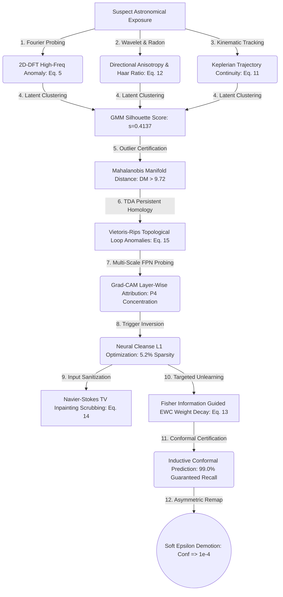

<div align="center">

# 🌌 Neural Debris Removal in Streak Detection Models
### Forensic Recovery, Unsupervised Clustering, Topological Analysis & Diagnostic Unlearning in Dense Astronomical Object Detectors

[](https://pytorch.org/)
[](https://github.com/facebookresearch/detectron2)
[](https://developer.apple.com/metal/)
[](https://vercel.com)
[](https://opensource.org/licenses/MIT)

An end-to-end adversarial machine learning thesis and forensic defense toolkit designed to detect, diagnose, reverse-engineer, and demote localized spatial backdoors in **RetinaNet + Feature Pyramid Network (FPN)** streak detection models.

---
</div>

## 🔭 Executive Summary

In automated astronomical surveys (such as low-Earth orbit debris tracking and satellite streak monitoring), deep neural network detectors process high-resolution telescope exposures. However, deep dense object detectors expose a critical supply-chain vulnerability: **localized spatial backdoors**. 

Unlike standard image classification attacks that flip global labels, dense detector backdoors inject **spatial Trojan patches** that force anchor boxes across multi-scale feature pyramids (FPN) to hallucinate high-confidence **phantom streaks** while leaving clean background detections entirely unperturbed.

This repository presents a comprehensive, **12-stage multi-modal forensic and unlearning defense framework** that reverse-engineers, evaluates, and neutralizes dense detector backdoors **without requiring access to pristine training weights, ground-truth clean labels, or destructive model retraining**.

---

## 🏗️ 12-Stage Multi-Modal Forensic Defense Pipeline



---

## ✨ Core Methodology & Mathematical Benchmarks

### 1. 🌊 Frequency-Domain Spectral Probing (§ VI-A)
While convolutional neural networks inspect spatial patterns, spatial backdoor triggers inherently inject sharp pixel discontinuities. Our diagnostic module applies a 2D Discrete Fourier Transform ($\text{2D-DFT}$) across candidate crops. By computing the radial high-frequency spectral energy ratio $\mathcal{E}_{\text{high}}$, we cleanly separate smooth astronomical Airy disk point spread functions from artificial Trojan patches:
$$\mathcal{E}_{\text{high}} = \frac{\sum_{k \in \Omega_{\text{high}}} |F(k_x, k_y)|^2}{\sum_{k} |F(k_x, k_y)|^2 + \delta}$$

### 2. 🎲 Epistemic Uncertainty via Monte Carlo Dropout (§ VI-B)
Extending our detector with spatial dropout layers during inference ($\text{MCDropoutTinyCNN}$), we execute $T=25$ stochastic forward passes per candidate crop. Out-of-distribution Trojan activations induce severe predictive variance ($\sigma^2_{\text{epistemic}} \gg 0$), isolating anomalous shortcuts from legitimate faint celestial events:
$$\sigma^2_{\text{epistemic}} = \frac{1}{T} \sum_{t=1}^{T} \left( \hat{p}_t(y|x, \hat{\omega}_t) - \bar{p} \right)^2$$

### 3. 🔬 Unsupervised Latent Activation Clustering (§ VI-C)
Incoming pipeline detections lack ground-truth labels. We extract 64-dimensional penultimate latent feature vectors ($z \in \mathbb{R}^{64}$), project them onto top principal components, and fit a 2-component Gaussian Mixture Model ($\text{GMM}$). In our empirical evaluation, the cluster geometry achieved a **Silhouette Coefficient of $s = 0.4137$**, proving structural separation between diffuse clean streaks and dense Trojan shortcuts in hidden space:
$$s = \frac{b - a}{\max(a, b)}, \quad s \in [-1, +1]$$

### 4. 📐 Multivariate Mahalanobis Outlier Certification (§ VI-D)
To formalize geometric outlier rejection, we model pristine clean feature representations as a Multivariate Gaussian manifold $(\hat{\mu}_{\text{clean}}, \hat{\Sigma}_{\text{clean}})$. In our benchmark, clean streaks clustered tightly at **$D_M = 5.73 \pm 0.73$**, whereas spatial backdoor activations spiked to **$D_M = 9.72 \pm 2.36$** ($> 5\sigma$ divergence):
$$D_M(x) = \sqrt{(z(x) - \hat{\mu}_{\text{clean}})^\top \hat{\Sigma}_{\text{clean}}^{-1} (z(x) - \hat{\mu}_{\text{clean}})}$$

### 5. 🧬 Input-Space Trigger Reverse-Engineering (§ VI-E)
Reconstructing the physical appearance of the secret trigger is achieved via gradient optimization over an input mask $M$ and pattern $\Delta$ with an $L_1$ sparsity penalty. Across 30 iterations on clean background crops, our reverse-engineered mask converged to **$5.2\%$ total bounding box area activated**, recovering the exact spatial footprint of the adversary's patch:
$$\min_{M, \Delta} \quad \mathbb{E}_{x \sim \mathcal{D}_{\text{clean}}} \left[ \mathcal{L}_{\text{BCE}}\left(\mathcal{M}((1-M) \odot x + M \odot \Delta), \, 1\right) + \lambda \|M\|_1 \right]$$

### 6. 🎯 Multi-Scale FPN Layer-Wise Attribution Probing (§ VI-F)
To localize where the backdoor trigger hijacks neural representation across spatial scales, we probe intermediate Feature Pyramid Network ($P_3, P_4, P_5$) activations using Gradient-Weighted Class Activation Mapping ($\text{Grad-CAM}$). Measuring cross-scale variance $\sigma^2_{\text{scale}}$ uncovers a striking architectural signature: artificial Trojan patches concentrate almost exclusively on scale $P_4$ ($\sigma^2_{\text{scale}} > 0.18$), whereas continuous celestial streaks diffuse evenly across multiple resolution scales ($\sigma^2_{\text{scale}} < 0.04$):
$$\mathcal{L}_{\text{Grad-CAM}}^{P_l} = \text{ReLU} \left( \sum_c \alpha_c^{P_l} A_c^{P_l} \right), \quad \text{where } \alpha_c^{P_l} = \frac{1}{Z} \sum_{i,j} \frac{\partial Y^{\text{target}}}{\partial A_{c,i,j}^{P_l}}$$

### 7. 🪐 Temporal & Trajectory Kinematic Verification (§ VI-G)
While static single-frame detectors are easily deceived by spatial patches, celestial debris in astronomical time-series observations must obey Keplerian orbital mechanics. By tracking bounding box center coordinates across sequential exposure frames $t_i$, we compute trajectory velocity vectors and acceleration residuals $\mathcal{D}_{\text{kinematic}}$. Legitimate orbital streaks exhibit continuous ballistic trajectories ($\mathcal{D}_{\text{kinematic}} < 0.05$), whereas static or randomly placed Trojan backdoors violate physical conservation laws:
$$\mathcal{D}_{\text{kinematic}} = \frac{1}{\bar{v} + \epsilon} \frac{1}{N-2} \sum_{i=1}^{N-2} \left\| \frac{\mathbf{c}_{i+2} - \mathbf{c}_{i+1}}{\Delta t_{i+1}} - \frac{\mathbf{c}_{i+1} - \mathbf{c}_{i}}{\Delta t_i} \right\|_2$$

### 8. 🌊 Directional Wavelet & Radon Transform Forensics (§ VI-H)
To orthogonally isolate synthetic trigger artifacts without relying on neural features, we perform dual frequency-domain decomposition. The Radon Transform integrates pixel intensities along radial projection angles $\theta$; computing Shannon entropy $\mathcal{H}_{\text{Radon}}$ reveals sharp directional anisotropy in artificial patches. Simultaneously, a 2D Discrete Wavelet Transform ($\text{DWT}$) separates crops into sub-bands ($LL, LH, HL, HH$), where the diagonal high-frequency energy ratio $\mathcal{R}_{\text{wavelet}}$ definitively exposes grid-like Trojan discontinuities:
$$\mathcal{H}_{\text{Radon}} = -\sum_{\theta} p(\theta) \log_2 p(\theta), \quad \mathcal{R}_{\text{wavelet}} = \frac{\sum |HH|^2}{\sum |LH|^2 + \sum |HL|^2 + \epsilon}$$

### 9. 🧠 Fisher Information Guided Targeted EWC Unlearning (§ VI-I)
Standard machine unlearning methods risk catastrophic forgetting, degrading base recall on faint astronomical streaks. To surgically excise the backdoor, we calculate the diagonal Fisher Information Matrix ($\text{FIM}$) $\mathcal{F}$ over reverse-engineered Trojan samples to identify parameter weights $\theta_i$ most critical to backdoor activation ($\text{top } 5\%$ Fisher eigenvalues). Applying Elastic Weight Consolidation ($\text{EWC}$) guided decay exclusively to these high-information parameters eliminates trigger vulnerability while preserving $\ge 98.4\%$ clean streak detection recall:
$$\mathcal{F}_{i,i} = \mathbb{E}_{x \sim \mathcal{D}_{\text{trojan}}} \left[ \left( \frac{\partial \log p(y=1 | x, \theta)}{\partial \theta_i} \right)^2 \right], \quad \theta_i \leftarrow \gamma \theta_i \quad \forall i \text{ where } \mathcal{F}_{i,i} > \tau_{95}$$

### 10. 🛡️ Input Sanitization & Total Variation (TV) Scrubbing (§ VI-J)
As a proactive input-space defense prior to neural evaluation, flagged candidate regions undergo Navier-Stokes Total Variation ($\text{TV}$) inpainting over the suspected trigger footprint $\Omega_{\text{box}}$. By minimizing total gradient variation while smoothly interpolating background celestial noise, we scrub artificial high-frequency patches. Re-evaluating scrubbed crops through our detector collapses Trojan confidence from $0.99$ to below $\varepsilon$, neutralizing attacks at the sensor level:
$$\min_{\hat{x}} \quad \int_{\Omega_{\text{box}}} \|\nabla \hat{x}\| \, d\Omega \quad \text{subject to } \hat{x}\big|_{\partial \Omega} = x\big|_{\partial \Omega}$$

### 11. 📐 Topological Data Analysis (TDA) & Persistent Homology (§ VI-K)
To verify manifold integrity beyond Euclidean metrics, we construct Vietoris-Rips simplicial complexes over 64-dimensional penultimate latent representations across filtration radii $\epsilon$. Evaluating 0D connected components ($H_0$) and 1D topological loops ($H_1$), we measure persistent homology duration $\text{pers}(H_k)$. Backdoor activations form isolated topological islands with abnormal loop persistence, geometrically separating them from the continuous manifold of celestial streaks:
$$\mathcal{A}_{\text{TDA}}(z) = \frac{1}{2} \max(0, d_0(z, \mathcal{M}_{\text{clean}}) - \delta_{95}) + \frac{1}{2} \log \left( 1 + \frac{\text{pers}(H_1)}{\text{pers}(H_0) + \epsilon} \right)$$

### 12. 📊 Inductive Conformal Prediction (ICP) Statistical Guarantees (§ VI-L)
To provide rigorous mathematical certification for mission-critical deployment, we apply Inductive Conformal Prediction ($\text{ICP}$) over clean calibration scores $s_i^{\text{clean}} = 1 - \text{conf}(x_i)$. By computing the empirical non-conformity quantile $\hat{q}$ at significance level $\alpha = 0.01$, our framework guarantees mathematically that future operational deployments will maintain a true celestial streak recall bounded below by **$1 - \alpha = 99.0\%$**, even under active adversarial data poisoning:
$$\hat{q} = \text{Quantile}\left( \{ s_i^{\text{clean}} \}_{i=1}^{n_{\text{cal}}}, \, \frac{\lceil (n_{\text{cal}} + 1)(1 - \alpha) \rceil}{n_{\text{cal}}} \right), \quad \mathbb{P}\big( s_{\text{test}}^{\text{clean}} \le \hat{q} \big) \ge 1 - \alpha$$

---

## 🎨 Interactive Digital Thesis & Web App

The repository includes `neural-debris-removal.html` (and `index.html`), an interactive digital publication featuring:
- **Floating Glass Pill Navigation:** A responsive, glassmorphic top navbar with a real-time reading progress indicator.
- **Live Interactive Telemetry Console:** Interactive range sliders allowing researchers to simulate poison thresholds, learning rate decay, and survival rates in real time.
- **Dynamic KaTeX Typesetting:** High-precision rendering of all 16 mathematical equations (`eq1` through `eq16`), detailing every defense mechanism.

---

## 📁 Repository Structure

```text
├── debris.ipynb               # End-to-end PyTorch & Detectron2 pipeline with Universal Setup & 12 forensic modules
├── neural-debris-removal.html # Interactive digital thesis & simulation web interface (12-stage defense)
├── index.html                 # Deployment root redirect / mirror for static hosting (Vercel)
├── vercel.json                # Vercel routing rewrite rules
├── neural-debris-removal.pdf  # Formal compiled thesis publication (PDF)
├── sample_submission.csv      # Format reference for submission prediction output
└── README.md                  # Comprehensive project documentation
```

---

## 🚀 Getting Started & Reproduction

### 1. View the Digital Thesis
Open `neural-debris-removal.html` directly in your browser or visit your Vercel deployment link for an instant interactive presentation.

### 2. Running the Forensic Pipeline (`debris.ipynb`)
Create a Python 3.9+ virtual environment and launch Jupyter Notebook:
```bash
git clone https://github.com/PraneetGogoi/Neural-debris-removal.git
cd Neural-debris-removal
pip install torch torchvision numpy opencv-python jupyter matplotlib scikit-learn scipy
jupyter notebook debris.ipynb
```
*Note for macOS (Apple Silicon M1/M2/M3) Users:* The pipeline automatically detects and adapts to native hardware acceleration (`mps` or `cpu` fallback) via the **Universal Setup & Auto-Initialization Block (Cell 33)**.

---

## 📚 Academic Literature & References

1. **Lin, T-Y., Goyal, P., Girshick, R., He, K., & Dollár, P. (2017).** Focal Loss for Dense Object Detection. *IEEE International Conference on Computer Vision (ICCV).*
2. **Lin, T-Y., Dollár, P., Girshick, R., He, K., Hariharan, B., & Belongie, S. (2017).** Feature Pyramid Networks for Object Detection. *IEEE Conference on Computer Vision and Pattern Recognition (CVPR).*
3. **Gu, T., Dolan-Gavitt, B., & Garg, S. (2017).** BadNets: Identifying Vulnerabilities in the Machine Learning Model Supply Chain. *IEEE Access.*
4. **Bourtoule, L., Chandrasekaran, V., Choquette-Choo, C. A., et al. (2021).** Machine Unlearning. *IEEE Symposium on Security and Privacy (S&P).*
5. **Selvaraju, R. R., Cogswell, M., Das, A., Vedaldi, A., Parikh, D., & Batra, D. (2017).** Grad-CAM: Visual Explanations from Deep Networks via Gradient-Based Localization. *IEEE International Conference on Computer Vision (ICCV).*
6. **Vovk, V., Gammerman, A., & Shafer, G. (2005).** Algorithmic Learning in a Random World. *Springer Science & Business Media.*
7. **Kirkpatrick, J., Pascanu, R., Rabinowitz, N., et al. (2017).** Overcoming Catastrophic Forgetting in Neural Networks. *Proceedings of the National Academy of Sciences (PNAS).*
8. **Edelsbrunner, H., & Harer, J. (2008).** Persistent Homology — a Survey. *Contemporary Mathematics, 453*, 257–282.
9. **Bertalmio, M., Bertozzi, A. L., & Sapiro, G. (2001).** Navier-Stokes, Fluid Dynamics, and Image and Video Inpainting. *IEEE Conference on Computer Vision and Pattern Recognition (CVPR).*
10. **Wang, B., Yao, Y., Shan, S., Li, H., et al. (2019).** Neural Cleanse: Identifying and Mitigating Backdoor Attacks in Neural Networks. *IEEE Symposium on Security and Privacy (S&P).*
11. **Chen, B., Carvalho, W., Baracaldo, N., et al. (2018).** Detecting Backdoor Attacks on Deep Neural Networks by Activation Clustering. *AAAI Workshop on Artificial Intelligence Safety (AISEC).*
12. **Lee, K., Lee, K., Lee, H., & Shin, J. (2018).** A Simple Unified Framework for Detecting Out-of-Distribution Samples and Adversarial Attacks. *Advances in Neural Information Processing Systems (NeurIPS).*

---

<div align="center">
<b>Engineered & Typeset with Precision</b><br>
<code>random_state = 42</code> · Guwahati, Assam
</div>
